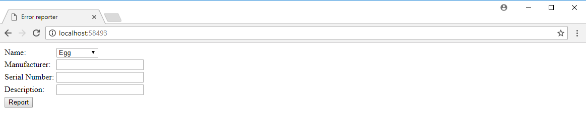
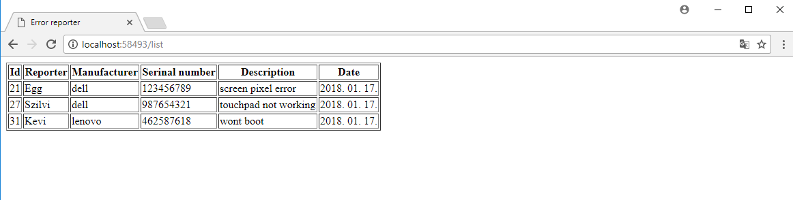

# Corsac Orientation Exam Retake

## 1) Green Fox Notebook Error Reporter

Build a webapp that people can use to report technical issues.

# Main page



- the **frontend** should have
    - a heading with the title of the site
    - form to register an error
      - dropdown list with all name options
      - input field to set the manufacturer
      - input field to set the serial number
      - input field to set the desciptrion
      - a REPORT button which send the form

## Backend
The backend should
  - validate incoming data
  - perform database calls

## Endpoints
- you should create these endpoints:

### GET `/`
This endpoint should render an HTML displaying the report form(explained above)

### GET `/list`
This endpoint should render an HTML displaying the full list of tickets(reported errors)


### POST `/report`
This endpoint should 
  - receive all the information of the error
  - supplement the issue with date
  - save the issue into database if the reporter's name is valid

### POST `/complete/{id}`
This endpoint should delete the specified ticket if the request's body contains `"secret" : "voala"`
  
### GET `/list/query`
This endpoint should return all the tickets which has matching either manufactorer or reporter

Example query:

`http://localhost:8080/list/query?manufacturer=dell`

- this should return a json with every ticket where the manufacturer is "dell"

```json
{
    "result": "ok",
    "tickets":
    [
        {
            "id" : "21",
            "reporter" : "Egg",
            "manufacturer" : "dell",
            "serialnumber" : 123456789,
            "description" : "screen pixel error",
            "date" : "2018.01.10"
        },
        {
            "id" : "27",
            "reporter" : "Szilvi",
            "manufacturer" : "dell",
            "serial number" : 987654321,
            "description" : "touchpad not working",
            "date" : "2018.01.17"
        }
    ]
}
```

`http://localhost:8080/list/query?reporter=Egg`

- this should return a json with every ticket where the reporter is "Egg"

## 2) Question time
  What is the difference between unit and integration testing?