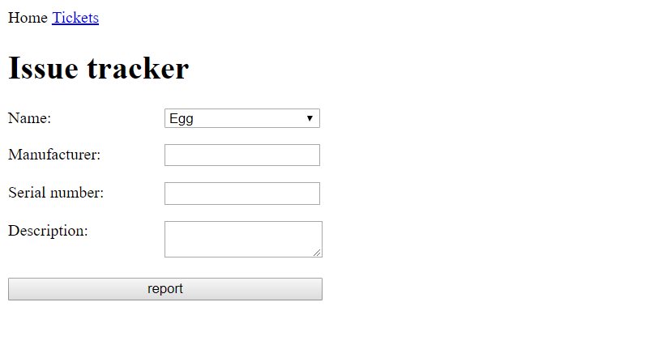
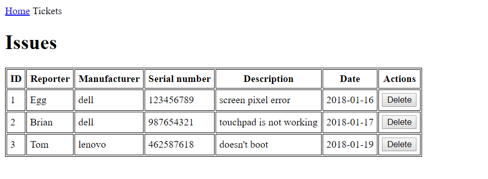

# JavaScript

## 0) Initialize an NPM package in this folder

 -  create `.gitignore` file for `node_modules` directory
 -  save your dependencies to the `package.json` file

## 1) Green Fox Notebook Error Reporter

Build a webapp that people can use to report technical issues.

### Frontend

The application consists of two screens.

#### Home (index.html)



It is built up from:

 -  a navigation bar, with a link to the tickets screen
 -  a heading with the title of the page
 -  a form to register a ticket
     -  dropdown list with all the names from the database
     -  input field to set the manufacturer
     -  input field to set the serial number
     -  textarea to set the description
     -  a REPORT button which should start an AJAX call to the `/tickets` endpoint with the form data

#### Tickets (tickets.html)



It is built up from:

 -  a navigation bar, with a link to the home screen
 -  a heading with the title of the page
 -  a table to display all the tickets from the database
    -  In the last column you should render a delete button which will remove the ticket permanently (also from the database)

### Backend

The backend should handle all the ticket related http requests and serve the static content to the application.

#### Static content

All the static files should be served from a dedicated folder (eg.: public, client, etc...)

#### Endpoints

##### GET `/users`

This endpoint is used to list all the available users

Example query:

[GET] `http://localhost:8080/users`

 -  this should return a json with the users collected from the database

```json
{
    "users":
    [
        {
            "id" : "1",
            "name" : "Egg"
        },
        {
            "id" : "2",
            "name" : "Tom"
        },
        ...
    ]
}
```

##### GET `/tickets`

This endpoint should be responsible to list the tickets from the database.

 -  if there is no query parameter, the backend must send all the tickets
 -  if there is a manufacturer query parameter, the backend must filter only the tickets with the given manufacturer
 -  if there is a reporter query parameter, the backend must filter only the the tickets which are reported by the given user
 -  the manufacturer and reporter query parameters can be mixed

Example query:

[GET] `http://localhost:8080/tickets?manufacturer=dell`

 -  this should return a json with every ticket where the manufacturer is "dell"

```json
{
    "tickets":
    [
        {
            "id" : "21",
            "reporter" : "Egg",
            "manufacturer" : "dell",
            "serialNumber" : 123456789,
            "description" : "screen pixel error",
            "date" : "2018.01.10"
        },
        {
            "id" : "27",
            "reporter" : "Brian",
            "manufacturer" : "dell",
            "serialNumber" : 987654321,
            "description" : "touchpad is not working",
            "date" : "2018.01.17"
        }
    ]
}
```

[GET] `http://localhost:8080/tickets?reporter=1`

 -  this should return a json with every ticket where the reporter's id is 1


[GET] `http://localhost:8080/tickets`

 -  this should return a json with all the tickets from the database

##### POST `/tickets`

This endpoint should:

 -  validate the sent data according to the following rules:
    -  reporter is a number
    -  manufacturer is set
    -  serial number is set
 -  supplement the ticket with the current date
 -  save the ticket into database
 -  set the status code to 400 if the validation failed
 -  set the status code to 500 if any database error has occured

Example query:

[POST] `http://localhost:8080/tickets`

 -  this should return a json with the newly created ticket

```json
{
    "id" : "22",
    "reporter" : "Brian",
    "manufacturer" : "dell",
    "serialNumber" : 123481639,
    "description" : "keyboard is not working",
    "date" : "2018.01.29"
}
```

##### DELETE `/tickets/:id`

It deletes the specified ticket if the request's header contains the Authorization `HTTP header` with the value of 'voala'. The endpoint should:

 -  validate the header
    -  if authorization header is missing it should return an empty response with a 401 status code
 -  delete the ticket from the database
 -  return an empty response with a 204 status code
 -  return an empty response with a 500 status code if any error has occured

Example query:

[DELETE] `http://localhost:8080/tickets/12`

 -  this should return an empty response, with a 204 status code

## 2) Question time

### a, What's the difference between Array.prototype.forEach and Array.prototype.map?

### b, Give us a an example usage of the map and forEach function.
